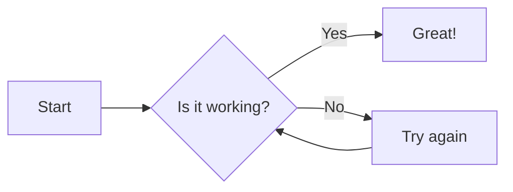

# A First Take

这里是uni的碎碎念博客！先在导航页来点花里胡哨的

this $E=m c^2$ is a typst test

$$
E=m c^2
$$

```mermaid
graph LR;
    A[Start] --> B{Is it working?};
    B -- Yes --> C[Great!];
    B -- No --> D[Try again];
    D --> B;
```
