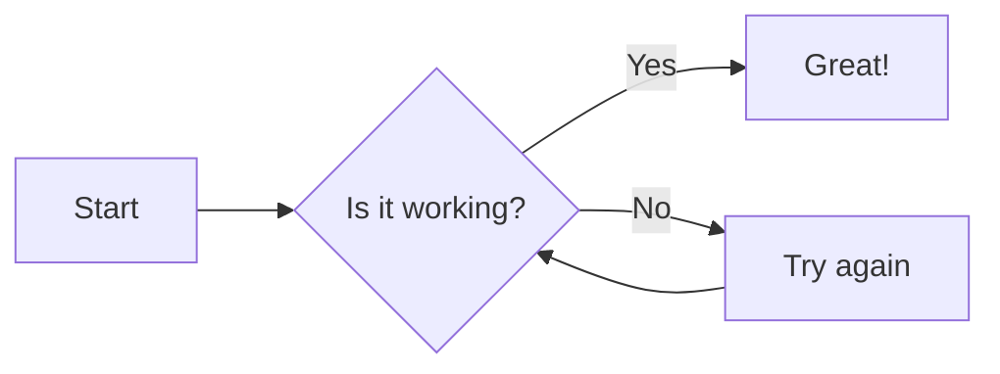

# A First Take

this $E=m c^2$ is a typst test

$
E=m c^2
$

or \(n\) ?

\[E=m c^2\]

```mermaid
graph LR;
    A[Start] --> B{Is it working?};
    B -- Yes --> C[Great!];
    B -- No --> D[Try again];
    D --> B;
```
