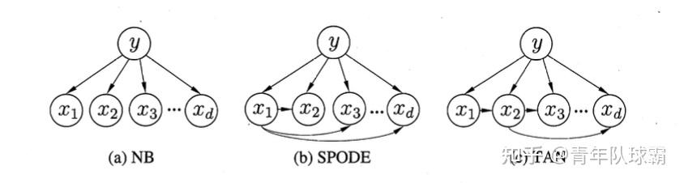

# 概率图理论

从贝叶斯学派出发，介绍到贝叶斯网络，并延申到高斯图和无向图。

## 贝叶斯学派

贝叶斯学派是区别于频率学派的另一大数据处理学派，体现了概率论领域两种不同的方法论：

!!! abstract

    两种理论的共性在于相信似然，也就是观察数据前的 $P("数据"|"参数")$ 。区别在于对参数的认知。
    
    频率主义者认为参数是未知的固定量，需要从随机但已观察到的数据中估计出来；贝叶斯主义者将参数视为具有已知分布（即后验）的未观察到的**随机**变量，其参数是固定的（即数据）。
    
    从这个意义上说，贝叶斯统计学中没有点估计参数，只有我们称之为后验分布的可能值的分布。

!!! note

    频率学派：

    - 哲学观：世界是客观且确定的，知识来源于对可重复事件的归纳，分布是客观的固有属性，概率是客观事实的参数，不变量是概率
    - 核心观点：频率是概率的经验基础，概率是频率的大数极限；推断的目标是利用样本数据来估计真值（未知但一定）的点或区间
    - 方法论：
      - 最大似然估计MLE：寻找能使观测到的数据出现的可能性（似然）最大的参数值，作为参数的点估计
      - 假设检验：通过设立原假设（通常是“无效果”或“无差异”的假设），然后计算在原假设为真的情况下，获得现有观测数据或更极端情况的概率（即p值）。如果p值非常小，则拒绝原假设。
      - 置信区间：构造一个区间，该区间的构造方法能够保证在多次重复实验中，有特定比例（如95%）的区间会包含参数的真实值。频率学派的置信区间**并不能解释为参数有95%的概率**落在这个区间内，只能理解为长期试验下的频率。
    - 成果：统计机器学习理论

!!! note

    贝叶斯学派：
    
    - 哲学观：世界是主观不能确定的，知识是先验主观与外部证据的组合产物，概率是主观信心的衡量，不变量是数据
    - 核心观点：任何推断都必须且只须根据后验分布，而不能再涉及样本分布。通过似然函数修正先验信息得到后验分布（对静态模型这就是新的先验信息，对动态模型需要进行状态转移，如Kalman滤波）
    - 方法论：
      - 贝叶斯公式：核心理论，描述了如何通过似然和先验得到后验MAP
      - 可信区间：与置信区间不同，95%的可信区间能解释为95%概率落在本区间
      - 贝叶斯因子：用于模型比较 $B F_10 =frac(P(D|H_1),P(D|H_0))$ 比1大说明假设 $H_1$ 更仿真。具体多可信参表处理。
    - 成果：贝叶斯概率图理论

回到基本理论，贝叶斯公式

$$
P(theta|D)=frac(P(D|theta)P(theta),P(D))=frac(P(D|theta)P(theta),sum_k P(D|C_k)P(C_k))
$$

也即，后验概率=似然×先验概率/边界似然。

- $P(theta)$(先验概率, Prior): 这是 “先验” 部分。它代表在观测到任何数据 D 之前，我们对参数 $theta$ 的信念、知识或假设。这可以是基于过往的经验、物理定律，甚至是主观的判断。它可以是无信息的（例如，假设所有参数值都是等可能的），也可以是强信息的（例如，根据之前的研究，我们相信某个参数的值很可能在一个小范围内）。
- $P(D|theta)$(似然函数, Likelihood): 这是 “似然” 部分。它表示在给定参数 $theta$ 的情况下，观测到数据 D 的可能性。似然函数会为那些能够更好地“解释”我们手中数据的参数 $theta$ 值赋予更高的权重
- $P(D)$(边界似然, Marginal Likelihood): 这是一个归一化过程，确保了后验概率逻辑有效

首先要考虑的是先验分布的选择，一般使用的有三类：

- 无信息先验：希望模型纯数据驱动时使用，避免先天倾向性，如均匀先验、JeffreyPrior、弱信息先验。问题是无信息先验难寻找，复杂条件下也不可靠
- 共轭先验：针对特定的似然函数（数据模型）找到属于同一个分布族的先验分布，使得先验分布与后验分布形式一致，数学上优雅。但应用场景很有限。
- 信息先验：使用经验拟合一个先验，这样的推断更稳健精确。

## 贝叶斯分类器

### 贝叶斯决策论

假设一个特征具有 $N$ 种类别标记 $YY={c_1,dots,c_N}$ ，定义 $lambda_(i j)$ 表示将真实标记为 $c_j$ 的的样本误分类为 $c_i$ 造成的损失，那么基于后验概率 $P(c_i|vb(x))$ 可以获得将样本 $vb(x)$ 分类为 $c_i$ 产生的期望损失，也即在样本 $vb(x)$ 上的条件风险

$$
R(c_i|vb(x))=sum_(j=1)^N lambda_(i j)P(c_j|vb(x))
$$

决策论的任务是，寻找一个合适的准则 $h:XX arrow YY$ 使得风险 $R(h)=E(R(h(vb(x)),vb(x)))$ 最小化

显然基于贪心的最优解为 $h^* (vb(x))=arg min_(c in YY) R(c|vb(x))$ ，称为贝叶斯最优分类器，对应的总体风险 $R(h^*)$ 称为贝叶斯风险（反映机器学习产生的精度理论上限）

若目标是最小化分类错误率，取 $lambda_(i j)=cases(0 quad &"if"i=j,1 quad &"otherwise")$ ，此时条件风险为 $R(c|vb(x))=1-P(c|vb(x))$ ，最优分类器为 $h^* (vb(x))=arg min_(c in YY) P(c|vb(x))$ ，即对每个样本，选择**使后验概率最大的类别标记**

从上面的分析可以看出，首先要研究后验概率 $P(c|vb(x))$ 。这一般是难以获得理论解的，因此机器学习是用不同方法估计后验概率。(1)
{.annotate}

1. 生成式如朴素贝叶斯和隐马尔可夫，其他基本都是判别式

- 判别式模型：给定 $vb(x)$ 可以直接建模 $P(c|vb(x))$ 来预测
- 生成式模型：先对联合概率 $P(c,vb(x))$ 建模，再由此获得 $P(c|vb(x))=frac(P(c)P(vb(x)|c),P(vb(x)))$
  - 由此，问题转化为如何基于训练数据 $D$ 估计先验 $P(c)$ 和似然 $P(vb(x)|c)$
  - 由大数定律，当训练集包含充足独立同分布样本时， $P(c)$ 使用**频率**估计（基于实用性的妥协，经验化）
  - 而频率估计似然是困难的（所有属性的联合概率，大数定律难满足），引入极大似然估计

!!! note "最大似然估计"

    假设 $P(vb(x)|c)$ 具有特定形式且被参数向量 $vb(theta_c)$ 唯一确定（即 $P=^Delta P(vb(x|theta_c))$），我们的任务转为估计参数 $vb(theta_c)$ 。

    令 $D_c$ 训练集 $D$ 中第 $c$ 类样本的集合，则似然为 $P(D_c|vb(theta_c))=product_(vb(x) in D_c) P(vb(x)|vb(theta_c))$ 并对数化为 $LL(vb(theta_c))=sum_(vb(x) in D_c) log P(vb(x)|vb(theta_c))$。所求为 $hat(vb(theta_c))=arg max_(vb(theta_c)) LL(vb(theta_c))$。

### 朴素贝叶斯分类器

!!! abstract "朴素性"

    NormalBayes的朴素性体现在假设所有特征条件彼此独立，使得似然公式大大简化。虽然一般独立性假设不成立，但实践中朴素贝叶斯分类器往往表现良好。

    $$
    P(vb(x)|c)=P(vb(x_1),vb(x_2),...,vb(x_d)|c)=product_(i=1)^d P(x_i|c)
    $$

### 半朴素贝叶斯分类器

折中的想法，只考虑一部分属性之间的依赖关系。常见策略为“独依赖估计”（OneDependentEstimator），顾名思义每个属性至多依赖一个其他属性。

$
  P(c|vb(x))~P(c) Pi_(i=1)^d P(x_i|c,p a_i)
$

其中 $p a_i$ 为属性 $x_i$ 所依赖的属性（父属性）。最简单的父属性选择称为“超父”（SuperParent），即只有一个父属性。

TreeAugmentnaiveBayes则在最大带权生成树的基础上缩约为下图TAN的结构：

- 计算任意两个属性的条件互信息 $I(x_i,x_j|y)=sum_(c in Y) P(x_i,x_j|c)log frac(P(x_i,x_j|c),P(x_i|c)P(x_j|c))$
- 以属性为节点构建完全图，边为互信息；然后构造完全图的最大带权生成树
- 以生成树的根为根变量，将图有向化
- 加入类别节点 $y$ ，并添加有向边

## 有向图：贝叶斯网络

贝叶斯网络/信度网络是目前不确定知识表达和推理领域最有效的模型之一。贝叶斯网络是一个有向无环图，其节点代表随机变量，有向边代表父节点对子节点的因果关系，条件概率表示关系的强度（没有父节点的节点用先验概率表达）。

接续前面的理论，我们假设一个节点条件概率只受到其父节点的影响。因此联合分布为：

$
  P(vb(x))=product_(i in Y) P(x_i|P\ar\en\t(x_i))
$

例如，对 $a->b,a->c,b->c$ 的简单图，联合分布为 $P(c|a,b)P(b|a)P(a)$

## 无向图：马尔可夫网络

## 连续图：高斯贝叶斯和高斯马尔可夫
