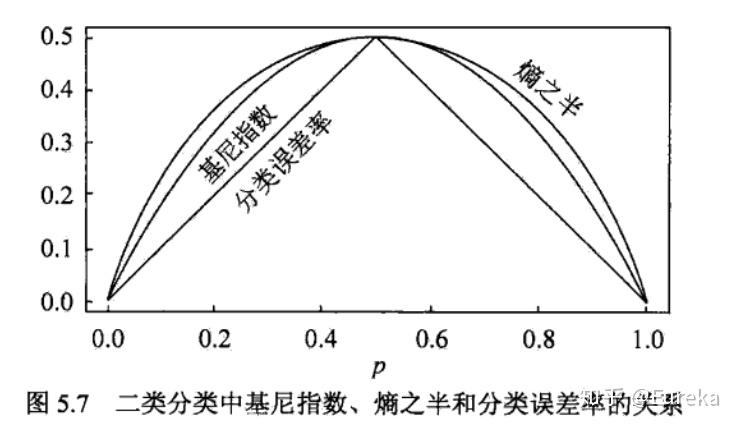

# 决策树

## 概述

分类决策树模型是一种描述对实例进行分类的树形结构。决策树由结点(node)和有向边(directed edge)组成。结点有有两种类型：内部结点(internal node)和叶结点(leaf node)。内部结点表示一个特征或属性，叶结点表示一个类。

在机器学习中，决策树是一个预测模型，它代表了对象属性与对象值之间的一种映射关系。它既可以用于分类问题，也可以用于回归问题。其优点是模型具有可读性，分类速度快。

决策树学习通常包括三个步骤：特征选择、决策树的生成、决策树的剪枝。

## 特征选择的理论基础

构造决策树，就是在回答一个问题：在递归生成子树的过程中，怎么挑选合适的特征分裂当前节点？

这里“合适”的定义是，这次分裂能使数据不确定度下降的最多，或者说，数据“纯度”提升最多。

常用的两个指标：

- 信息熵 $"Entropy"(S)=-sum_i p_i log_2 p_i$
- 基尼不纯度 $"Gini"(S)=1-sum_i p_i^2$

### 信息熵与不确定度增量

信息熵是所有可能产生的信息量 $-log_2 p_i$ 的期望，信息量这样定义是为了满足：非负+线性可加+连续+关于可能态数量正相关。当底数取2时单位称为bit，底数取e时称为nat

信息熵在概率均匀分布时最大 $H(X)<=log n$

#### 联合熵与条件熵

对于任意的两个离散变量 $X,Y$ 联合熵定义为

$$
H(X,Y)=-sum_(x in cal(X)) sum_(y in cal(Y)) P(x,y)log_2 P(x,y)
$$

定义条件熵，来说明获得 $X$ 的信息时， $Y$ 的不确定度下降了多少。使用贝叶斯：

$$
H(Y|X)&=sum_(x in cal(X)) P(x)H(Y|X=x)=-sum_(x in cal(X)) P(x) {-sum_(y in cal(Y)) P(y|x)log_2 P(y|x)}\
&=-sum_(x in cal(X)) sum_(y in cal(Y)) P(x,y)log_2 P(y|x)
$$

联立以上给出链式法则：

$$
H(X,Y)=H(X)+H(Y|X)
$$

### 信息增益

信息增益是ID3算法的主要参考指标，衡量一次分裂中信息熵的减少量

#### KL散度，相对熵

定义两个概率分布的质量密度函数 $p(x),q(x)$ 之间的KL散度为相对熵

$$
D(p||q)=sum_(x in cal(X)) p(x) log frac(p(x),q(x))=E_p (log frac(p(x),q(x)))
$$

#### 互信息，信息增益

互信息即信息增益，表示了解一者对另一者信息熵的消除量，具有交换性

$$
I(X,Y)&=sum_(x in cal(X)) sum_(y in cal(Y)) p(x,y) log frac(p(x,y),p(x)p(y))=D(p(x,y)||p(x)p(y))\
&=H(X)-H(X|Y)=H(Y)-H(Y|X)
$$

当然，实践中一般是使用特征$A$对训练集$D$进行分裂，是单向度的 $g(D,A)$

### 信息增益比

以信息增益作为划分训练数据集的特征，存在偏向于选取值较多的特征的问题：

为了补偿，昆布又提出了信息增益比进行矫正。

定义特征A对训练集D的信息增益比为：A对D的信息增益与D对A的经验熵之比

$$
I_R (D,A)=frac(I(D,A),H_A(D)),"其中"H_A(D)=-sum_(i=1)^n frac(abs(D_i),abs(D))log_2 frac(abs(D_i),abs(D))
$$

### 基尼不纯度

## 经典决策树生成算法

### ID3算法

!!! note "变量规定"

    定义：$D$ 为数据集，$A$ 为特征集，$C$ 为标签类（监督学习），$epsilon$ 为阈值

对当前节点，做如下递归操作

1. 若 $D$ 中所有实例已经属于同一类标签$C_k$，说明 $H(D)=-1 dot log 1=0$ 。该节点不延申子节点，并以该标签作为节点标签
2. 若当前 $A=nothing$ ，或$forall A_k in A,g(D,A_k)$ 相同。不延申子节点，并取其中占比最高的标签作为节点标签
3. $forall A_k in A$ ，计算该特征造成的信息增益，并选出最大的一个 $A_g=arg max_A g(D,A)$
   (a) 若 $g(D,A_g)<epsilon$ 则同2. 处理
   (b) 否则用最佳特征分裂当前数据集生成子节点
4. 用特征集 $A \\ {A_g}$ 递归处理子数据集

#### ID3的不足

- 未考虑连续特征，应用范围窄
- ID3倾向于选择可取值多的特征（例如每个数据点都特征不同，完全识别，但没有意义）
- 未考虑缺失值问题
- 未解决过拟合问题

### C4.5算法

C4.5成功解决了上述四个问题

#### 连续特征离散化

比如 $m$ 个样本的连续特征 $A$有 $m$ 个，从小到大排列为 $a_1,dots,a_m$，则C4.5取相邻两样本值的平均数，一共取得 $m-1$ 个划分点，其中第 $i$ 个划分点 $T_i$ 表示为： $T_i=frac(a_i+a_(i+1),2)$。对于这 $m-1$ 个点，分别计算以该点作为二元分类点时的信息增益。选择信息增益最大的点作为该连续特征的二元离散分类点。比如取到的增益最大的点为 $a_t$，则小于 $a_t$的值为类别1，大于 $a_t$ 的值为类别2，这样我们就做到了连续特征的离散化。要注意的是，与离散属性不同的是，如果当前节点为连续属性，则该属性后面还可以参与子节点的产生选择过程。

#### 信息增益比的作用

使用除法形式引入惩罚因子 $"SplitInfo"(D,A)=H_A(D)$ ，惩罚分割过细导致的分裂不确定度。这本质是一种标准化，将目标从**总信息熵下降**转化为**单位分裂度的信息熵下降**

#### 缺失值处理

1.一方面要解决的是在样本某些特征缺失的情况下选择划分的属性

方法：计算信息增益（或信息增益比）时，仅使用在该特征上没有缺失值的样本。然后，将计算出的信息增益乘以一个权重，这个权重等于无缺失样本所占的比例。通过这种方式，C4.5对含有较多缺失值的特征进行了“惩罚”。一个特征缺失的样本越多，它的权重就越低，其最终的信息增益值也就越低，从而降低了被选为最佳分裂特征的可能性。

2.另一方面要解决选定了划分属性，对于在该属性上缺失特征的样本的处理。

方法：不将该样本丢弃，也不简单地将其归入某一分支，而是将该样本按比例分配到所有子节点中。每个分支分配到的，是该样本的一个带有权重的“部分”或“副本”（称为分数样本 Fractional Instance）。这个权重等于无缺失样本进入该分支的比例。

#### 过拟合：悲观错误剪枝

悲观错误剪枝PEP的核心思想是：不能天真地相信训练集上的错误率，必须对节点的真实错误率进行一个更“悲观”的估计。

PEP自底向上的遍历，进行后剪枝。

!!! note "悲观错误数"

    对于一个覆盖了 $N$ 个训练样本，其中犯了 $E$ 个错误（错误分类）的叶节点：
    
    - 训练错误率 $f=E/N$
    - 悲观估计：C4.5假设，这 $E$ 次错误是在 $N$ 次独立实验中发生的，这可以看作一个二项分布。训练错误率 $f$ 只是对真实错误率 $p$ 的一个样本估计。我们想知道，真实错误率 $p$ 的上限可能是多少。
    - C4.5利用二项分布的正态近似，计算出真实错误率 $p$ 的一个置信区间的上限 $U_"CF" (E, N)$。
    - 该叶节点的悲观错误数为 $N dot U_"CF"$
    - 一棵树的的悲观错误数为其所有叶子节点的加和

对于每一个待考察的内部节点 T，算法会比较两种情况下的“悲观错误数”：

- 情况一：保留该子树
- 情况二：将该子树剪掉，使其变为一个叶节点
- 如果情况二的悲观错误数不比情况一的悲观错误数差，那么就进行剪枝。

## CART算法

### CART生成

具体来说流程如下：对回归树用平方最小化准则/对分类树用基尼指数 Gini index 最小化准则，进行特征选择，生成二叉树。

#### 分类树

假设有 $K$ 类，样本点属于第 $k$ 类的概率为 $p_k$ 则概率分布的基尼指数为：

$$
"Gini"(p)=sum_(k=1)^(K) p_k (1-p_k)=1-sum_(k=1)^K p_k^2
$$

扩展到给定样本集合 $D$ ，其基尼指数如下，其中 $C_k$ 为属于第 $k$ 类的样本数量

$$
"Gini" (D)=1-sum_(k=1)^K (frac(abs(C_k),abs(D)))^2
$$

一般而言我们采取二分法

$$
"Gini"(p)=2p(1-p),"Gini"(D,A)=frac(abs(D_1),abs(D))"Gini"(D_1)+frac(abs(D_2),abs(D))"Gini"(D_2)
$$

如上图所示，二分条件下基尼指数是熵的好近似。根据基尼系数可以类似ID3的构造分类树

#### 回归树

CART回归树的度量目标是，对于任意划分特征 $A$ ，对应的任意划分点 $s$ 两边划分成的数据集 $D_1$ 和 $D_2$ ，求出使 $D_1$ 和 $D_2$ 各自集合的均方差最小，同时 $D_1$ 和 $D_2$ 的均方差之和最小所对应的特征和特征值划分点。

假设 $X$ 与 $Y$ 分别为输入和输出变量，并且 $Y$ 是连续变量，给定训练数据集 $D={(x_1,y_1),dots,(x_N,y_N)}$ 。可选取第 $j$ 个变量 $x_j$ 及其取值 $s$ 作为切分变量和切分点，并由此定义两个区域

$$
R_1 (j,s)={x|x_j<=s}, R_2 (j,s)={x|x_j>s}
$$

最优切分满足以下表达式，其中 $c_m="average"(y_i|x_i in R_m)$

$$
j,s=arg min_(j,s) [min_(c_1) sum_(x_1 in R_1)(y_i-c_1)^2+min_(c_2) sum_(x_i in R_2)(y_i-c_2)^2]
$$

### CART剪枝

一般采用代价复杂度剪枝法CPP，其核心是将剪枝问题转化为一个优化问题，最小化一个正则损失函数 $C_alpha (T)=C(T)+alpha abs(T)$

其中第一项称为经验误差/拟合度 $C(T)=sum_(t=1)^(abs(T)) [N_t dot H_t (T)]$ ， $N_t$ 是叶子节点样本数， $H_t$ 是叶子节点不纯度， $abs(T)$ 是树 $T$ 的叶子节点总数

第二项是正则化惩罚， $alpha>=0$ ，惩罚子树的复杂程度

具体的剪枝按以下操作进行：

1. 使用训练数据拟合一个尽可能复杂的决策树 $T_0$ 初始化 $alpha_(min)=+infinity$ ，最优子树集合 $omega=T$
2. 从 $T_0$ 开始剪枝，从叶子节点自下而上计算各内部节点的“剪枝性价比”指标 $g(t)=frac(C(t)-C(T_t),abs(T_t)-1)$ ，并更新 $alpha_(min)=min(g(t),alpha_(min))$
3. 一次完整遍历得到所有节点 $alpha$ 值构成的集合 $M$
4. $alpha_k=arg min M$ 作为判断阈值，自上而下的剪去所有最值得剪枝的子树，得到最优子树 $T_k$
5. 最优子树集合 $omega=omega union T_k,M=M-{alpha_k}$ 不断循环直到 $M=nothing$
6. 使用交叉验证在 $omega$ 中选择最优子树 $T_alpha$

!!! note "交叉验证"

    如果给定的样本数据充足，进行模型选择的一种简单方法是随机地将数据集切分成三部分，分别为训练集、验证集和测试集。训练集用来训练模型，验证集用于模型的选择，而测试集用于最终对学习方法的评估。在学习到的不同复杂度的模型中，选择对验证集有最小预测误差的模型。由于验证集有足够多的数据，用它对模型进行选择也是有效的。

    但是，在许多实际应用中数据是不充足的。为了选择好的模型，可以采用交叉验证方法。交叉验证的基本想法是重复地使用数据；把给定的数据进行切分，将切分的数据集组合为训练集与测试集，在此基础上反复地进行训练、测试以及模型选择。

常用的有K折交叉验证，即先将数据集分割为K个互不相交等份，然后每次取K-1份作为训练集，剩下的一份作为测试集，重复K次，最后选出测试效果最佳的一次
